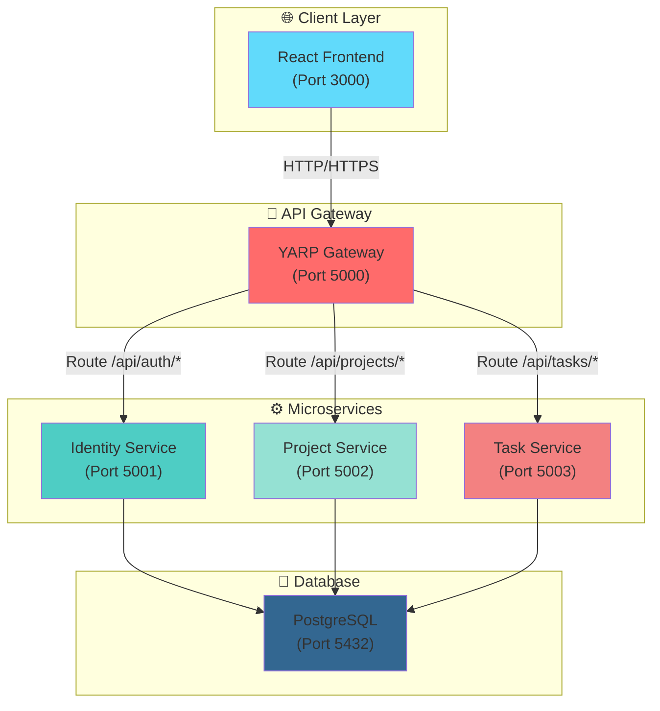
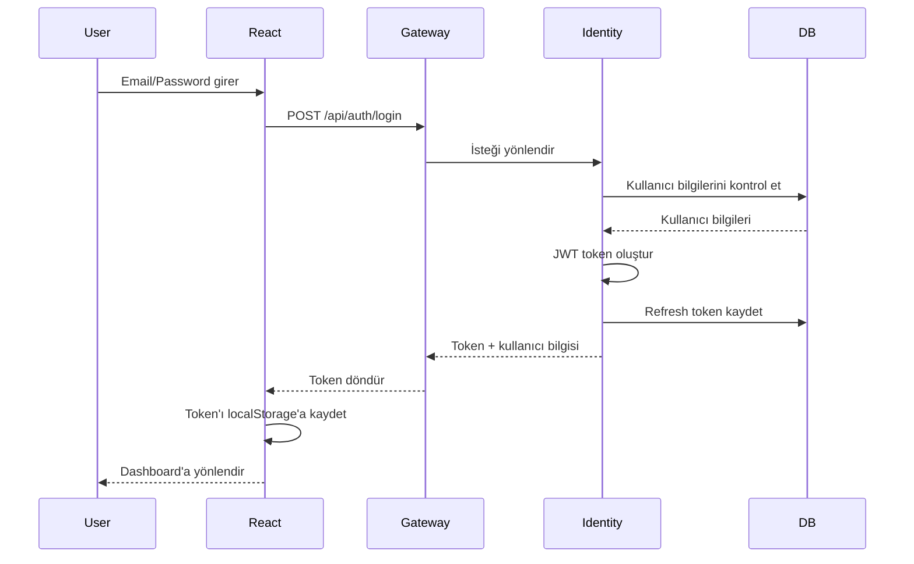
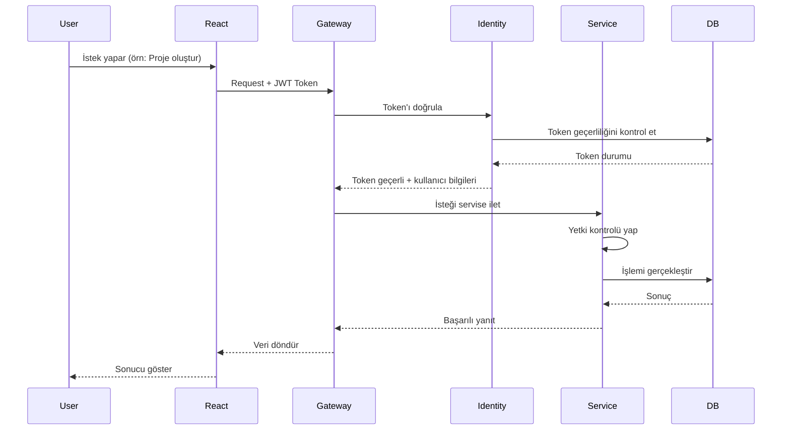
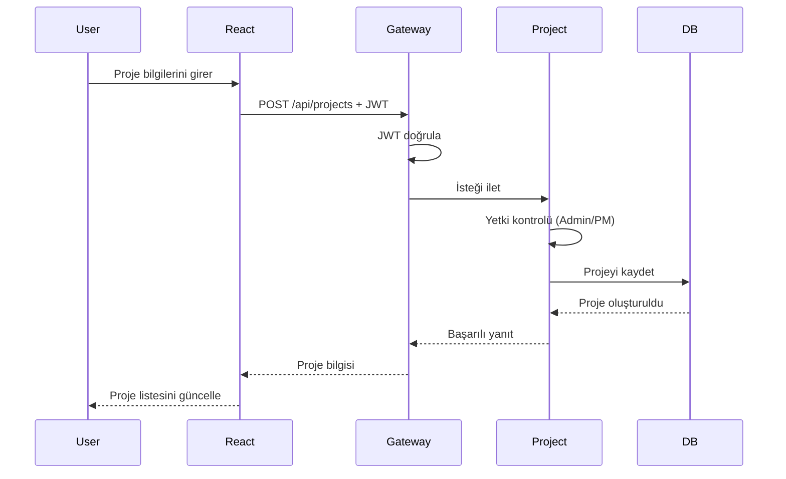
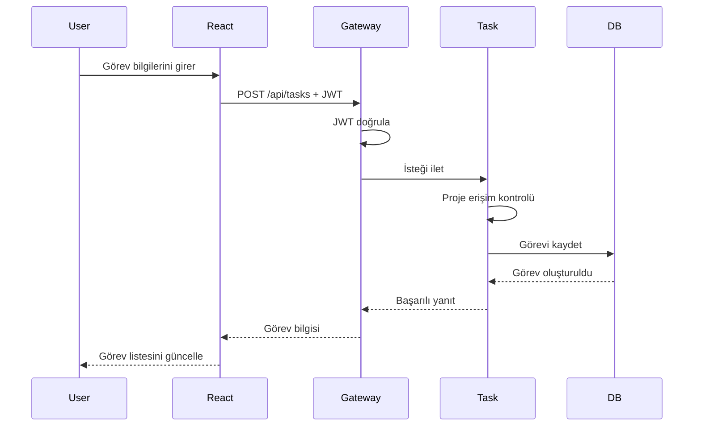

# 🎯 **PROJE PLANI: Mini Jira Task Management**

## 📋 **PROJE TANIMI ve KAPSAMI**

### **Proje Nedir?**
Mini Jira Task Management, küçük ve orta ölçekli ekipler için geliştirilmiş bir proje ve görev yönetim sistemidir. Jira ve Trello'nun basitleştirilmiş bir karışımı gibi düşünülebilir.

### **Temel Özellikler:**
```
✅ Kullanıcı Yönetimi: Kayıt, giriş, JWT tabanlı kimlik doğrulama
✅ Rol Bazlı Sistem: 3 temel rol (Admin, Project Manager, Developer)
✅ Proje Yönetimi: Proje oluşturma, takım yönetimi, yetkilendirme
✅ Görev Yönetimi: Görev oluşturma, atama, durum takibi (Todo → InProgress → Done)
✅ Yetkilendirme: Rol ve proje bazlı erişim kontrolleri
✅ Responsive UI: Modern React arayüzü
✅ Microservice Mimarisi: .NET 8 ile geliştirilmiş bağımsız servisler
✅ Containerization: Docker ile container'laştırma
```

### **Hedef Kitle:**
- Küçük/orta ölçekli yazılım ekipleri
- Proje yöneticileri
- Geliştiriciler
- Takım liderleri

---

## 🏗️ **MİMARİ DİYAGRAMLARI**

### **Sistem Mimarisi:**



**Mimari Açıklama:**
- **React Frontend**: Kullanıcı arayüzü, tüm istekler API Gateway'e gider
- **API Gateway (YARP)**: Tüm isteklerin tek giriş noktası, routing ve JWT doğrulama yapar
- **Identity Service**: Kullanıcı kimlik doğrulama ve JWT token üretimi
- **Project Service**: Proje yönetimi işlemleri
- **Task Service**: Görev yönetimi işlemleri
- **PostgreSQL**: Tüm servisler aynı veritabanını kullanır (farklı schema'lar)

### **Veritabanı Şeması:**
```
POSTGRESQL DATABASE: taskmanagement

┌─────────────────────────────────────────────────────────────────────────────┐
│                          VERİTABANI ŞEMASI                                 │
│                                                                             │
│  IDENTITY SCHEMA (Kimlik Doğrulama):                                       │
│  ┌─────────────────┐       ┌─────────────────┐                             │
│  │     users       │       │ refresh_tokens  │                             │
│  ├─────────────────┤       ├─────────────────┤                             │
│  │ • id (PK)       │1     *│ • id (PK)       │                             │
│  │ • email         │◄──────┤ • user_id (FK)  │                             │
│  │ • password_hash │       │ • token         │                             │
│  │ • full_name     │       │ • expires_at    │                             │
│  │ • role          │       │ • created_at    │                             │
│  │ • is_active     │       └─────────────────┘                             │
│  │ • created_at    │                                                       │
│  │ • updated_at    │                                                       │
│  └─────────────────┘                                                       │
│                                                                             │
│  PROJECT SCHEMA (Proje Yönetimi):                                          │
│  ┌─────────────────┐       ┌─────────────────┐                             │
│  │    projects     │       │  project_users  │                             │
│  ├─────────────────┤       ├─────────────────┤                             │
│  │ • id (PK)       │1     *│ • project_id (FK)│                             │
│  │ • name          │◄──────┤ • user_id (FK)  │*                            │
│  │ • description   │       │ • role_in_project│────┐                       │
│  │ • created_by    │       │ • joined_at      │    │                       │
│  │ • created_at    │       └─────────────────┘    │                       │
│  │ • updated_at    │                               │                       │
│  └─────────────────┘                               │                       │
│                                                    │                       │
│  TASK SCHEMA (Görev Yönetimi):                    │                       │
│  ┌─────────────────┐                               │                       │
│  │     tasks       │                               │                       │
│  ├─────────────────┤                               │                       │
│  │ • id (PK)       │                               │                       │
│  │ • title         │                               │                       │
│  │ • description   │                               │                       │
│  │ • status        │                               │                       │
│  │ • priority      │                               │                       │
│  │ • project_id (FK)◄──────────────────────────────┘                       │
│  │ • assignee_id   │                                                     │
│  │ • created_by    │                                                     │
│  │ • due_date      │                                                     │
│  │ • created_at    │                                                     │
│  │ • updated_at    │                                                     │
│  └─────────────────┘                                                     │
│                                                                             │
│  Her microservice kendi schema'sını kullanır                              │
│  Shared database, separate schemas pattern                                │
└─────────────────────────────────────────────────────────────────────────────┘
```

### **Login Akışı:**



**Login Akışı Adımları:**
1. Kullanıcı email ve şifre ile giriş yapar
2. React Frontend isteği API Gateway'e gönderir
3. Gateway isteği Identity Service'e yönlendirir
4. Identity Service veritabanından kullanıcıyı kontrol eder
5. Şifre doğruysa JWT access token ve refresh token oluşturur
6. Refresh token veritabanına kaydedilir
7. Token'lar kullanıcıya döndürülür
8. Frontend token'ları localStorage'a kaydeder
9. Kullanıcı dashboard'a yönlendirilir

### **Yetkilendirme Akışı:**



**Yetkilendirme Akışı Adımları:**
1. Kullanıcı bir işlem yapmak ister (örn: proje oluşturma)
2. React Frontend isteği JWT token ile birlikte API Gateway'e gönderir
3. Gateway token'ı Identity Service'e göndererek doğrular
4. Identity Service token'ın geçerliliğini kontrol eder
5. Token geçerliyse kullanıcı bilgileri (claims) Gateway'e döner
6. Gateway kullanıcı bilgilerini HttpContext'e ekler
7. İstek ilgili microservice'e (Project/Task) yönlendirilir
8. Microservice kullanıcının yetkisini kontrol eder (rol, proje erişimi)
9. Yetki varsa işlem gerçekleştirilir ve sonuç döner
10. Sonuç kullanıcıya gösterilir

**Hata Durumları:**
- Token geçersiz/expired → 401 Unauthorized, login'e yönlendir
- Yetki yok → 403 Forbidden, hata mesajı göster

### **🔐 Yetkilendirme Best Practices:**

**Soru:** Yetki kontrolü nerede yapılmalı? API Gateway'de mi, Microservice'te mi?

**Cevap:** **Her ikisinde de yapılmalıdır** - Bu yaklaşım "Defense in Depth" (Derinlemesine Savunma) prensibidir.

#### **İki Katmanlı Yetkilendirme Yaklaşımı:**

**1. API Gateway Seviyesinde (Authentication + Temel Kontroller):**
- ✅ JWT token doğrulaması yapılır
- ✅ Token geçerliliği kontrol edilir (expiry, signature)
- ✅ Token'dan kullanıcı bilgileri (claims) çıkarılır
- ✅ Temel rol kontrolü yapılabilir (Admin, PM, Developer)
- **Amaç:** Geçersiz istekleri erken engellemek, performans iyileştirmek

**2. Microservice Seviyesinde (Detaylı Authorization):**
- ✅ Kullanıcının **spesifik kaynağa erişim hakkı** kontrol edilir
- ✅ **Proje bazlı erişim kontrolü** yapılır (kullanıcı bu projeye erişebilir mi?)
- ✅ **İş mantığı seviyesinde yetkilendirme** (örn: sadece proje sahibi silebilir)
- ✅ Veritabanından kaynak sahipliği doğrulanır
- **Amaç:** İş kurallarını uygulamak, veri seviyesinde güvenlik sağlamak

#### **Neden Her İkisinde de Yapılmalı?**

| Senaryo | Gateway'de Kontrol | Microservice'te Kontrol |
|---------|-------------------|------------------------|
| Geçersiz token | ✅ Engeller | ❌ Gereksiz (zaten engellendi) |
| Token geçerli ama yetkisiz kullanıcı | ⚠️ Kısmen engeller | ✅ Tam engeller |
| Başkasının projesine erişim | ❌ Bilemez | ✅ Engeller |
| Servisler arası direkt çağrı | ❌ Bypass edilebilir | ✅ Güvenlik sağlar |

#### **Örnek Senaryo:**

```
Kullanıcı A (Developer) → Proje X'i silmeye çalışıyor

1. Gateway: Token geçerli ✓, Rol: Developer ✓ → İlet
2. Project Service: 
   - Kullanıcı A'nın Proje X'e erişimi var mı? ✓
   - Ama Developer rolü proje silebilir mi? ❌
   - → 403 Forbidden döner
```

**Sonuç:** Bu yaklaşım production ortamlarında **industry standard**'dır ve Microsoft, Amazon gibi büyük şirketler tarafından kullanılır.

### **Proje Oluşturma Akışı:**



**Proje Oluşturma Adımları:**
1. Kullanıcı proje adı, açıklama gibi bilgileri girer
2. React Frontend isteği JWT token ile Gateway'e gönderir
3. Gateway JWT token'ı doğrular
4. İstek Project Service'e yönlendirilir
5. Service kullanıcının Admin veya Project Manager rolünde olduğunu kontrol eder
6. Yetki varsa proje veritabanına kaydedilir
7. Başarılı yanıt döner ve proje listesi güncellenir

### **Görev Oluşturma Akışı:**



**Görev Oluşturma Adımları:**
1. Kullanıcı görev başlığı, açıklama, proje seçimi yapar
2. React Frontend isteği JWT token ile Gateway'e gönderir
3. Gateway JWT token'ı doğrular
4. İstek Task Service'e yönlendirilir
5. Service kullanıcının seçilen projeye erişim yetkisi olduğunu kontrol eder
6. Yetki varsa görev veritabanına kaydedilir (status: Todo)
7. Başarılı yanıt döner ve görev listesi güncellenir

---

## 📅 **GENEL ZAMAN ÇİZELGESİ**
**Toplam: 6-8 Hafta** (Part-time, 15-20 saat/hafta)

```
Hafta 1-2: Backend Foundation (Identity + Gateway)
Hafta 3-4: Core Services (Project + Task)
Hafta 5-6: React Frontend (UI + Integration)
Hafta 7-8: İleride Eklenecek Özellikler + Dağıtım + Dokümantasyon
```

## 🏗️ **MİMARİ KARARLARI**

### **BACKEND (.NET 8)**
```
┌─────────────────────────────────────────────────────────┐
│  MİKROSERVİS MİMARİSİ (4 Servis)                        │
├─────────────────────────────────────────────────────────┤
│ 1. Identity Service     → JWT Auth + Refresh Token      │
│ 2. Project Service      → CQRS + MediatR + EF Core      │
│ 3. Task Service         → CQRS + MediatR + EF Core      │
│ 4. API Gateway (YARP)   → Routing + JWT Validation      │
└─────────────────────────────────────────────────────────┘
```

### **FRONTEND (React + TypeScript)**
```
┌─────────────────────────────────────────────────────────┐
│  MODERN REACT STACK                                     │
├─────────────────────────────────────────────────────────┤
│ • Vite + TypeScript        → Build tool                 │
│ • React Router v6          → Client-side routing       │
│ • React Query (TanStack)   → Server state management   │
│ • Zustand                  → Client state management   │
│ • Context API              → Auth state only           │
│ • React Hook Form + Zod    → Form handling             │
│ • Material-UI (MUI)        → UI components             │
│ • Axios                    → HTTP client               │
└─────────────────────────────────────────────────────────┘
```

## 📋 **DETAYLI GELİŞTİRME PLANI**

### **HAFTA 1: IDENTITY SERVICE + ALTYAPI**

**Hedef:** JWT Authentication çalışır hale gelsin
```
├── [ ] 1.1 Proje Kurulumu
│   ├── .NET 8 Solution oluştur
│   ├── Identity Service projesi
│   ├── PostgreSQL docker-compose setup
│   └── Entity Framework Core 8
│
├── [ ] 1.2 User ve Role Entity'leri
│   ├── User (Id, Email, PasswordHash, Role, IsActive)
│   ├── Role enum (Admin, ProjectManager, Developer)
│   ├── RefreshToken entity
│   └── EF Core configurations
│
├── [ ] 1.3 JWT Authentication
│   ├── JWT token generation service
│   ├── Login endpoint (email/password)
│   ├── Register endpoint
│   ├── Refresh token endpoint
│   └── Password hashing (BCrypt)
│
├── [ ] 1.4 Database Migration
│   ├── Code-first migrations
│   ├── Seed data (admin user)
│   └── Connection string configuration
│
└── [ ] 1.5 Postman Testleri
    ├── Login/Register testleri
    ├── JWT validation test
    └── Refresh token flow test
```

**Teknolojiler:** .NET 8, EF Core 8, PostgreSQL, JWT, BCrypt.Net, Docker

### **HAFTA 2: API GATEWAY + DOCKER SETUP**

**Hedef:** Tüm servisler Docker'da çalışsın
```
├── [ ] 2.1 API Gateway (YARP) Kurulumu
│   ├── YARP nuget package
│   ├── Route configuration (appsettings.json)
│   ├── JWT validation middleware
│   └── CORS configuration
│
├── [ ] 2.2 Docker Container'ları
│   ├── PostgreSQL container
│   ├── Identity Service container
│   ├── API Gateway container
│   └── docker-compose.yml
│
├── [ ] 2.3 Service Communication
│   ├── HTTP client configuration
│   ├── Service discovery (docker network)
│   └── Health check endpoints
│
├── [ ] 2.4 Configuration Management
│   ├── appsettings.Development.json
│   ├── appsettings.Production.json
│   ├── Environment variables
│   └── Connection string management
│
└── [ ] 2.5 Logging ve Monitoring
    ├── Serilog setup (console + file)
    ├── Request/Response logging
    └── Error handling middleware
```

**Teknolojiler:** YARP, Docker, Docker Compose, Serilog, ASP.NET Core Middleware

### **HAFTA 3: PROJECT SERVICE (CQRS + MEDIATR)**

**Hedef:** Proje CRUD ve takım yönetimi çalışsın
```
├── [ ] 3.1 Project Service Kurulumu
│   ├── .NET 8 Web API projesi
│   ├── CQRS + MediatR nuget packages
│   ├── Project entity model
│   └── Database context
│
├── [ ] 3.2 CQRS Implementasyonu
│   ├── Commands (CreateProject, UpdateProject)
│   ├── Queries (GetProjects, GetProjectById)
│   ├── Command/Query handlers
│   └── DTOs (Data Transfer Objects)
│
├── [ ] 3.3 MediatR Pipeline Behaviors
│   ├── Validation behavior (FluentValidation)
│   ├── Logging behavior
│   ├── Transaction behavior
│   └── Authorization behavior
│
├── [ ] 3.4 Business Logic
│   ├── Project-User many-to-many (ProjectUser)
│   ├── Authorization rules (rol bazlı)
│   ├── Validation rules
│   └── Business exceptions
│
├── [ ] 3.5 Repository Pattern
│   ├── Generic repository interface
│   ├── Unit of Work pattern
│   ├── Project-specific repository
│   └── Async methods
│
└── [ ] 3.6 API Endpoints
    ├── GET /api/projects (list)
    ├── POST /api/projects (create)
    ├── PUT /api/projects/{id} (update)
    └── Authorization: [Authorize(Roles = "Admin,ProjectManager")]
```

**Teknolojiler:** MediatR, FluentValidation, AutoMapper, Repository Pattern, EF Core

### **HAFTA 4: TASK SERVICE + AUTHORIZATION**

**Hedef:** Görev yönetimi ve detaylı authorization
```
├── [ ] 4.1 Task Service Kurulumu
│   ├── .NET 8 Web API projesi
│   ├── Task entity model (Task, Status, Priority)
│   ├── Database context
│   └── Migration
│
├── [ ] 4.2 Task Management Features
│   ├── Task CRUD operations
│   ├── Status workflow (Todo → InProgress → Done)
│   ├── Priority levels (Low, Medium, High, Critical)
│   └── Assignee (User) relationship
│
├── [ ] 4.3 Advanced Authorization
│   ├── Custom authorization attributes
│   ├── Project-based authorization
│   ├── User can only see assigned tasks
│   └── Admin can see all, PM sees project tasks
│
├── [ ] 4.4 Business Rules
│   ├── Task assignment rules
│   ├── Status transition rules
│   ├── Notification triggers
│   └── Validation rules
│
├── [ ] 4.5 API Endpoints
│   ├── GET /api/tasks (filter by project/user)
│   ├── POST /api/tasks (create)
│   ├── PUT /api/tasks/{id}/status (update status)
│   ├── PUT /api/tasks/{id}/assign (assign to user)
│   └── Authorization with claims
│
└── [ ] 4.6 Integration Testing
    ├── Postman collection
    ├── Test different user roles
    ├── Test authorization scenarios
    └── API documentation (Swagger)
```

**Teknolojiler:** ASP.NET Core Authorization, Claims-based auth, Swagger/OpenAPI

### **HAFTA 5: REACT FRONTEND - AUTH + DASHBOARD**

**Hedef:** Login çalışsın ve dashboard görünsün
```
├── [ ] 5.1 React Proje Kurulumu
│   ├── Vite + TypeScript template
│   ├── Project structure (src/components, src/pages)
│   ├── ESLint + Prettier configuration
│   └── Path aliases (@/components)
│
├── [ ] 5.2 Auth Context Implementation
│   ├── AuthContext (Context API)
│   ├── Login/Logout functions
│   ├── Token storage (localStorage/HttpOnly cookie)
│   └── ProtectedRoute component
│
├── [ ] 5.3 React Query Setup
│   ├── QueryClient configuration
│   ├── Axios interceptor (JWT token)
│   ├── Error handling
│   └── React Query DevTools
│
├── [ ] 5.4 UI Components (MUI)
│   ├── Theme provider (light/dark)
│   ├── Layout component (Header, Sidebar)
│   ├── Login page
│   ├── Dashboard page
│   └── Loading/Error components
│
├── [ ] 5.5 Routing
│   ├── React Router v6 setup
│   ├── Protected routes
│   ├── Role-based routing
│   └── Layout wrapper
│
└── [ ] 5.6 State Management
    ├── Zustand store (UI state)
    ├── Auth state (Context API)
    ├── Server state (React Query)
    └── Form state (React Hook Form)
```

**Teknolojiler:** Vite, React 18, TypeScript, Context API, React Query, MUI, React Router

### **HAFTA 6: REACT FRONTEND - PROJECT & TASK MANAGEMENT**

**Hedef:** Proje ve görev yönetimi UI tamamlansın
```
├── [ ] 6.1 Project Management UI
│   ├── Project list page
│   ├── Project create/edit form
│   ├── Project detail page
│   └── Add/remove team members
│
├── [ ] 6.2 Task Management UI
│   ├── Task list (table/kanban view)
│   ├── Task create/edit modal
│   ├── Task detail page
│   └── Drag & drop status change
│
├── [ ] 6.3 Forms and Validation
│   ├── React Hook Form setup
│   ├── Zod schema validation
│   ├── Form components (MUI integration)
│   └── Error display
│
├── [ ] 6.4 Real-time Updates
│   ├── React Query optimistic updates
│   ├── Auto-refresh on data change
│   ├── Toast notifications (react-toastify)
│   └── Loading states
│
├── [ ] 6.5 Role-based UI
│   ├── Admin panel (user management)
│   ├── Project manager features
│   ├── Developer view restrictions
│   └── Conditional rendering
│
└── [ ] 6.6 Responsive Design
    ├── Mobile-friendly layout
    ├── MUI responsive utilities
    ├── Sidebar collapse on mobile
    └── Touch-friendly interactions
```

**Teknolojiler:** React Hook Form, Zod, react-toastify, MUI Data Grid, Drag & Drop

### **HAFTA 7: İLERİDE EKLENECEK ÖZELLİKLER**

**Hedef:** Profesyonel özellikler ekle
```
├── [ ] 7.1 Notification Service (Opsiyonel)
│   ├── Email notification (SendGrid/SMTP)
│   ├── Task assigned notification
│   ├── Status change notification
│   └── Background service (Hangfire)
│
├── [ ] 7.2 File Upload
│   ├── Task attachment upload
│   ├── Azure Blob Storage / Local storage
│   ├── File validation (size, type)
│   └── Progress indicator
│
├── [ ] 7.3 Search and Filter
│   ├── Full-text search (EF Core)
│   ├── Advanced filtering
│   ├── Pagination (offset/keyset)
│   └── Sorting
│
├── [ ] 7.4 Export/Import
│   ├── Export tasks to CSV/Excel
│   ├── Import from Excel
│   ├── Batch operations
│   └── Progress reporting
│
└── [ ] 7.5 Performance Optimization
    ├── Redis caching (frequent queries)
    ├── React.memo + useCallback
    ├── Code splitting (React.lazy)
    └── Bundle optimization
```

**Teknolojiler:** Hangfire, Azure Storage, Redis, ClosedXML, EF Core Extensions

### **HAFTA 8: TEST, DEPLOY, DOCUMENTATION**

**Hedef:** Proje production-ready olsun
```
├── [ ] 8.1 Testing
│   ├── Backend unit tests (xUnit)
│   ├── Backend integration tests
│   ├── Frontend unit tests (Vitest)
│   └── E2E tests (Cypress/Playwright)
│
├── [ ] 8.2 CI/CD Pipeline
│   ├── GitHub Actions workflow
│   ├── Build and test automation
│   ├── Docker image build
│   └── Deployment script
│
├── [ ] 8.3 Documentation
│   ├── README with setup instructions
│   ├── API documentation (Swagger)
│   ├── Architecture diagram
│   └── Code comments
│
├── [ ] 8.4 Security Hardening
│   ├── Helmet.js (security headers)
│   ├── Rate limiting
│   ├── SQL injection prevention
│   └── XSS protection
│
└── [ ] 8.5 Mülakat Hazırlığı
    ├── Proje sunumu hazırla
    ├── Mimari kararlarını özetle
    ├── Öğrendiklerini liste
    └── Demo hazırlığı
```

**Teknolojiler:** xUnit, Vitest, Cypress, GitHub Actions, Swagger, Docker

## 📊 **TEKNOLOJİ ÖĞRENME HEDEFLERİ**

### **.NET 8 ÖĞRENECEKLERİN:**
```
✅ Microservice Architecture
✅ JWT Authentication + Refresh Token
✅ CQRS Pattern with MediatR
✅ Repository + Unit of Work Pattern
✅ Entity Framework Core (Code-first)
✅ ASP.NET Core Middleware Pipeline
✅ Docker Containerization
✅ API Gateway (YARP)
✅ FluentValidation
✅ Serilog for Structured Logging
```

### **REACT ÖĞRENECEKLERİN:**
```
✅ TypeScript with React
✅ React Hooks (Custom hooks)
✅ State Management (Context API + Zustand + React Query)
✅ React Router v6 (Protected routes)
✅ React Hook Form + Zod Validation
✅ Material-UI Component Library
✅ Axios Interceptors
✅ Error Boundary
✅ Code Splitting (React.lazy)
✅ Performance Optimization
```

## 🎯 **MÜLAKAT İÇİN HAZIRLIK**

### **Anlatabileceğin Konular:**
1. **"Microservice mimarisini neden seçtim?"**
2. **"JWT vs Session authentication kararım"**
3. **"CQRS pattern'ının faydaları"**
4. **"React'ta state management stratejim"**
5. **"Docker containerization ve faydaları"**
6. **"API Gateway ile cross-cutting concerns"**
7. **"Security best practices implementasyonum"**
8. **"Performance optimization yaptığım yerler"**

### **Demo'da Göstereceklerin:**
```
1. Login with different roles
2. Role-based UI differences
3. Project creation and team assignment
4. Task management workflow
5. Real-time updates
6. Responsive design
7. Error handling
8. Loading states
```

## 📁 **PROJE YAPISI**

```
task-management-system/
├── backend/
│   ├── src/
│   │   ├── IdentityService/
│   │   ├── ProjectService/
│   │   ├── TaskService/
│   │   └── ApiGateway/
│   ├── tests/
│   ├── docker-compose.yml
│   └── README.md
├── frontend/
│   ├── src/
│   │   ├── components/
│   │   ├── pages/
│   │   ├── contexts/
│   │   ├── hooks/
│   │   ├── services/
│   │   ├── stores/
│   │   ├── types/
│   │   └── utils/
│   ├── public/
│   ├── package.json
│   └── README.md
└── README.md (ana proje)
```

## ⚡ **HIZLI BAŞLANGIÇ İÇİN ÖNCELİK SIRASI**

1. **Hafta 1:** Identity Service (JWT çalışsın)
2. **Hafta 2:** API Gateway + Docker (servisler birbiriyle konuşsun)
3. **Hafta 5:** React Auth (login çalışsın)
4. **Hafta 3:** Project Service (temel CRUD)
5. **Hafta 6:** React Project UI (frontend-backend entegrasyonu)

**Önemli:** Her hafta sonunda **çalışan bir şey** olmalı. MVP (Minimum Viable Product) odaklı ilerle.

## 🚀 **BAŞLANGIÇ ADIMLARI**

**Bugün yapabileceklerin:**
1. [ ] GitHub repo oluştur
2. [ ] .NET 8 solution oluştur
3. [ ] Identity Service projesini başlat
4. [ ] PostgreSQL docker container çalıştır
5. [ ] İlk migration'ı oluştur

**Yarın:**
1. [ ] JWT token generation implemente et
2. [ ] Login endpoint yaz
3. [ ] Postman ile test et

**Bu planla:**
- ✅ Sektörde kullanılan teknolojileri öğreneceksin
- ✅ Gerçek proje deneyimi kazanacaksın
- ✅ Mülakatlarda anlatacak profesyonel bir projen olacak
- ✅ Full-stack development deneyimi edineceksin
